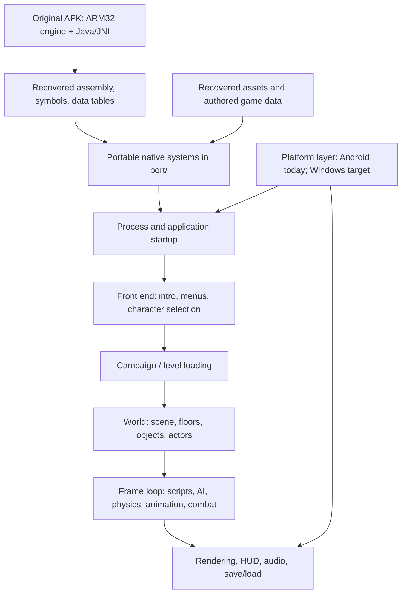

# Dungeon Hunter 2 reconstruction map — 7 October 2026

This map separates recovered evidence, reconstructed systems, and integrated app behavior. It is a guide to the current workspace, not a claim that the complete game has been restored.

## The big picture



The game is a native C++ engine with a Java/JNI Android wrapper, authored XML/script/table data, and a large binary asset cache. The original engine is ARM32. The recovered decompiler output is a navigation aid; the original instructions, call sites, symbols, and controlled comparisons are the evidence. This repository does not contain the original studio C++ source.

## How to think about the architecture

There are three different things in this workspace that can look like “the game”:

1. **Original behavior evidence.** The supplied APK's machine code, symbols, JNI declarations, data files, and cache. The IDA export is under `.local-inputs/ida-apk-export-2026-10-07`; source recovery notes start at [IDA-EXPORT-HANDOFF-2026-10-07.txt](IDA-EXPORT-HANDOFF-2026-10-07.txt). A decompiled function is not ready-to-build source by itself.
2. **Reconstructed native components.** Portable modules under `port/`, each replacing a bounded part of the original and carrying its own tests and limits. Many are checked against original ARM32 instruction execution. Passing such a check proves that component for tested inputs, not that the whole application is wired together.
3. **Integrated application checkpoints.** Saved APKs and the current working Android app connect selected components into a runnable experience. Different checkpoints have different scope. The published/native prototype can run a Crypt scene and player loop; the current full-startup experiment is trying to connect the original-style process and menu path to the newer campaign systems. Those are not the same acceptance test.

## Major subsystems and where to look

| Layer | Responsibility | Main source area | Current evidence / boundary |
| --- | --- | --- | --- |
| Platform and process | App lifecycle, input surface, initialization, JNI boundary | `port/android-native/`, `port/nativeinterface/` | Android is the active host. Windows needs a platform layer and a desktop application composition; it is a target, not an existing full port. |
| Asset/resource foundation | BRES file views, pointer fixups, mesh and animation payloads | `port/engine-resources/`, `port/asset-payloads/`, `port/engine-textures/` | Resource readers, BRES fixups, type-0 meshes, and many animation access/search routines are reconstructed and compared. Images/materials, split resources, ownership, and full rendering remain open. |
| Math and animation | Vectors/quaternions, authored tracks, animation selection and playback | `port/engine-math/`, `port/engine-animation/`, `port/engine-skinning/` | Strong component-level differential coverage. A fully faithful original pose/render path is still broader than the proven kernels. |
| Scene and rendering | Scene hierarchy, materials, cameras, GPU upload and draw | `port/scene-materials/`, `port/android-native/app/src/main/cpp/` | A new GLES2 renderer displays reconstructed scenes and actors. This is not a reconstruction of every original renderer/driver contract. |
| Game data and scripts | Tables, formulas, rules, Lua and authored event data | `port/game-data/`, `port/script-runtime/`, `port/level-world/` | Many parsers and selected execution paths are source-built and checked. Complete script host/service integration is unfinished. |
| Campaign and level | Process/menu transition, level selection/loading, floors and object creation | `port/level-loader/`, `port/level-world/`, Android startup adapters | Full original-style process startup now reaches the rendered main menu and occupied-slot character preview. The Play-to-campaign transition and level load have not yet been verified. |
| Actors and gameplay | Character state, AI, navigation, physics, skills, combat, loot and quests | `port/level-world/`, `port/physics-backend/` | Significant player movement/combat and physics components work in checkpoints. Full enemy AI, equipment, quests, inventory, and campaign acceptance remain incomplete. |
| UI and presentation | Intro/menu/HUD, text, audio, save/load | `port/engine-ui/`, `port/engine-audio/`, app adapters | The original intro, splash, menu movie, main-menu labels/buttons, occupied save metadata, and 3D character preview render in the integrated emulator run. Menu input reaches the authored controls; navigation beyond the visible main-menu state is still under verification. |

## A useful runtime sequence

The original-style route we are currently trying to connect is:

```text
Android/desktop host
  → native process initialization (GSInit and retained application services)
  → intro/movie completion
  → MenuManager initialization and authored UI/HUD setup
  → menu_splash → rendered MainMenu
  → occupied selected profile and 3D character preview
  → Play / selected profile (not yet runtime-verified)
  → campaign and level load
  → world/scene/floors/objects/player creation
  → repeated gameplay frame (scripts, AI, physics, animation, combat)
  → render/audio/UI updates and save/load
```

An error at a step means execution has reached that boundary and a required owner, resource, or callback was not available in the reconstructed path. Fixing it can reveal the next missing dependency. That is why sequential errors do not mean every previously working system was broken; they often mean the earlier run exercised a shorter route.

## Why the current menu effort felt chaotic

The earlier successful menu view exercised a direct front-end preview path. It did not establish that the full process initialization, canonical `MenuManager.Init`, HUD/control callbacks, menu FSM, and campaign providers all formed one working chain. The current integrated run has now passed that startup chain and reached the occupied-save main menu. Earlier errors exposed missing connections one boundary at a time; they were not evidence that the already-tested Crypt/player prototype or every previous menu piece had regressed.

The practical mistake was treating “the menu looked right” as if it meant “the original startup architecture was connected.” Those are different milestones. We should track them separately and keep a dependency map beside the error log.

## A sane reconstruction order

1. **Keep the original evidence organized by subsystem.** For each behavior, record function address, callers/callees, relevant data format, and what has actually been compared or observed.
2. **Define portable interfaces around recovered behavior.** Do not copy ARM32 object layouts blindly into 64-bit code; reconstruct ownership, handles, and lifetimes explicitly.
3. **Make component tests answer narrow questions.** Compare against original ARM32 execution where possible, and retain explicit unsupported cases.
4. **Build a desktop host early.** Use the same portable C++ systems and real assets with a Windows platform layer. Keep Android lifecycle/JNI behind its adapter. A desktop host can make iteration and controller input easier without pretending it validates Android-specific behavior.
5. **Integrate by vertical slices.** First a complete startup-to-menu route; then profile-to-level load; then one small area with a player, one enemy, one interaction, combat, and save/reload. Each slice must run end to end before scope expands.
6. **Treat controller support as platform input, not gameplay architecture.** Define actions (move, confirm, back, attack, skills, target, menu) and map keyboard/mouse, touch, and controller devices to those actions. Gameplay should consume actions, not device-specific button codes.
7. **Replace rough reconstructed pieces deliberately.** Preserve observed game behavior where desired, but improve internals behind stable interfaces and tests. Keep “faithful compatibility” and “design improvement” decisions explicit so a cleanup does not silently change game rules.

## Current honesty line

- There is substantial original binary/data evidence and many individually reconstructed native modules.
- There are playable native prototype checkpoints for a limited Crypt/player slice.
- The latest integrated emulator run reaches the original main menu using the existing occupied Warrior save: it shows the level/Act 1/Boglands metadata, the 3D preview character and scene, and the Start Game/Options/Info controls. The prior FSM, ObjectManager, menu-root search, script-session, PhysicalWorld, Quest serialization, PostLoad, MainMenu.Update, and initial Play3D blockers now advance through their former boundaries.
- The offline `NativeStartFromGCInvite` callback now returns the source-faithful no-invite result, preventing the EventManager delivery failure. The fresh x86_64 APK was tested from `app/build/intermediates/apk/debug/app-debug.apk`; `outputs/apk/debug` can still be stale. An Options tap played the original confirm sound but did not visibly change the menu, so menu navigation/settings are not yet accepted. Start Game and campaign loading were not tested, and the save was left untouched.
- Windows-only delivery, complete controller support, complete campaign/quests, and a faithful full-game rewrite are future work. The workspace has reusable foundations for them, but they are not already solved by the Android prototype.

For the live task state, see [STARTUP-BROAD-CHECK-2026-10-07.md](STARTUP-BROAD-CHECK-2026-10-07.md), [ACT1-DELIVERY-TRACKER-2026-10-06.md](ACT1-DELIVERY-TRACKER-2026-10-06.md), and [ROADMAP.md](../port/android-native/ROADMAP.md). For the evidence base and limits, see [RECONSTRUCTION-HANDOFF.md](../RECONSTRUCTION-HANDOFF.md), [STATUS.md](STATUS.md), and [PORTING.md](PORTING.md).
